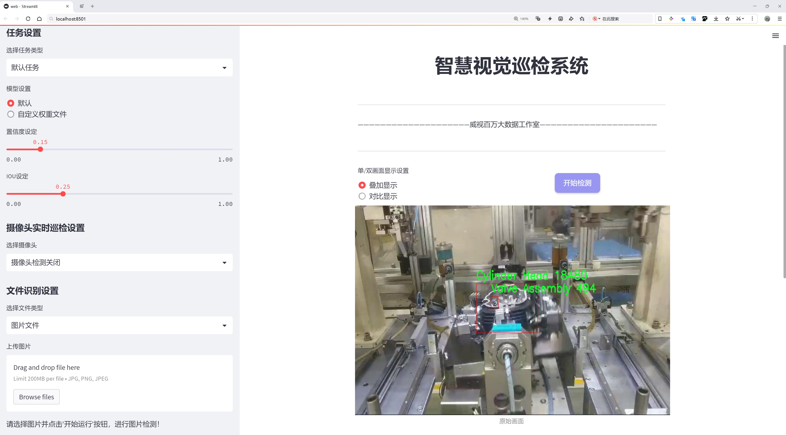
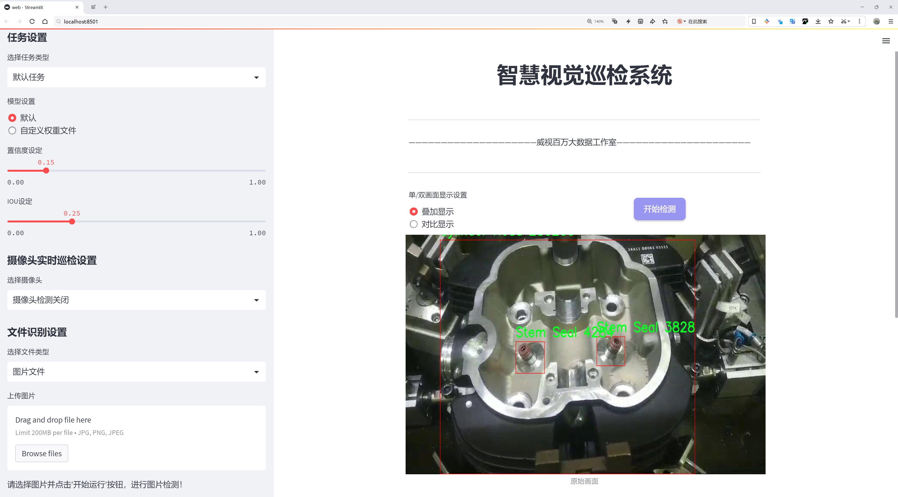
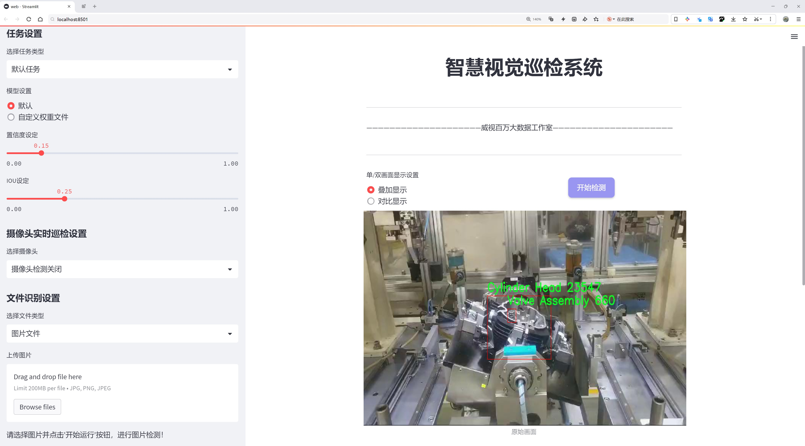
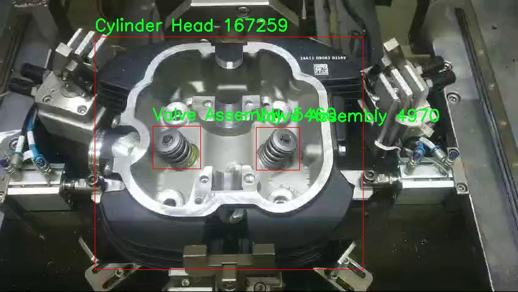
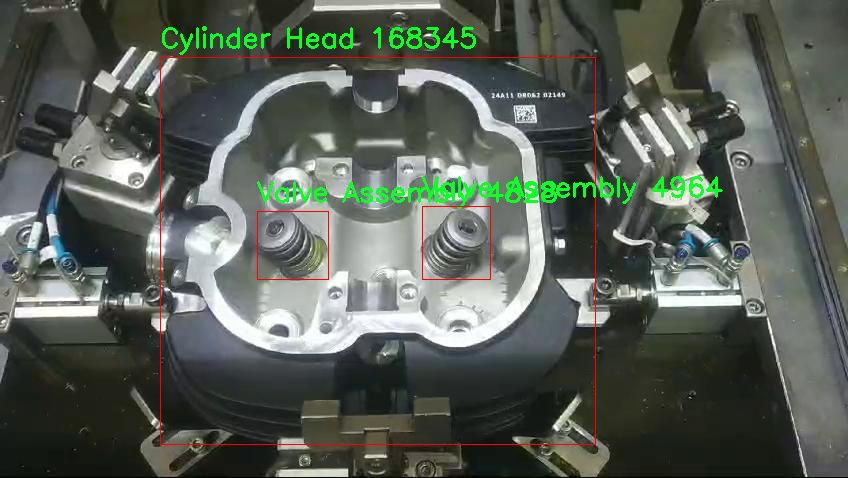
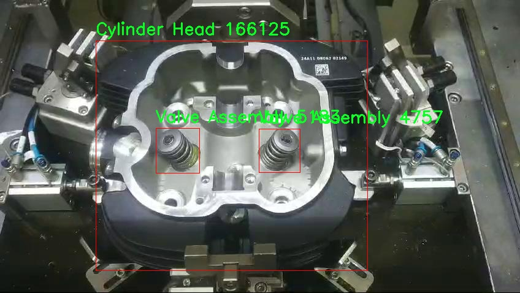
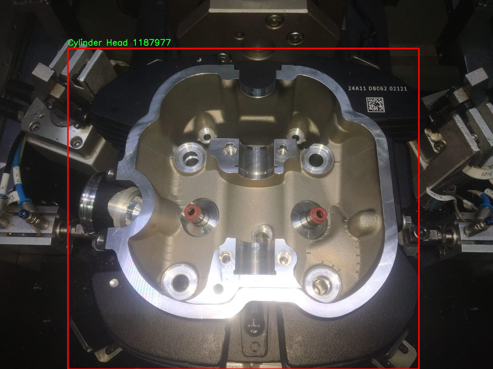

# 汽车零部件检测检测系统源码分享
 # [一条龙教学YOLOV8标注好的数据集一键训练_70+全套改进创新点发刊_Web前端展示]

### 1.研究背景与意义

项目参考[AAAI Association for the Advancement of Artificial Intelligence](https://gitee.com/qunshansj/projects)

项目来源[AACV Association for the Advancement of Computer Vision](https://gitee.com/qunmasj/projects)

研究背景与意义

随着全球汽车工业的快速发展，汽车零部件的质量和安全性愈发受到重视。汽车零部件的检测不仅关系到整车的性能与安全，还直接影响到消费者的使用体验和企业的市场竞争力。在这一背景下，传统的人工检测方法因其效率低、易出错等缺陷，逐渐无法满足现代汽车制造业对高效、精准检测的需求。因此，基于计算机视觉的自动化检测系统应运而生，成为提升汽车零部件检测效率和准确性的有效解决方案。

近年来，深度学习技术的迅猛发展为目标检测领域带来了革命性的变化。YOLO（You Only Look Once）系列模型以其快速、准确的特点，广泛应用于各类目标检测任务中。YOLOv8作为该系列的最新版本，进一步提升了检测精度和速度，适应了更复杂的检测场景。然而，尽管YOLOv8在一般物体检测任务中表现出色，但在特定领域如汽车零部件检测中，仍存在一些挑战，例如小目标检测困难、背景复杂性高等。因此，改进YOLOv8以适应汽车零部件检测的需求，具有重要的理论和实践意义。

本研究将基于改进YOLOv8的汽车零部件检测系统，利用包含4000张图像和6个类别（气缸盖、排气阀、弹簧座垫圈、带夹的弹簧、密封圈、阀门组件）的数据集进行训练和测试。该数据集的构建不仅涵盖了汽车零部件的多样性，还提供了丰富的样本，能够有效提升模型的泛化能力。通过对数据集的深入分析与处理，研究将探索如何优化YOLOv8的网络结构和训练策略，以提高其在汽车零部件检测中的表现。

本研究的意义在于，首先，能够为汽车制造企业提供一种高效、准确的零部件检测解决方案，降低人工成本，提高生产效率。其次，通过对YOLOv8的改进，推动目标检测技术在汽车工业中的应用，促进相关技术的进步与发展。此外，研究还将为后续的相关研究提供基础数据和模型支持，推动智能制造领域的进一步发展。

综上所述，基于改进YOLOv8的汽车零部件检测系统的研究，不仅具有重要的学术价值，也具有广泛的应用前景。通过提升汽车零部件的检测效率和准确性，能够有效保障汽车的安全性和可靠性，为消费者提供更优质的产品体验，同时也为汽车行业的智能化转型贡献力量。

### 2.图片演示







##### 注意：由于此博客编辑较早，上面“2.图片演示”和“3.视频演示”展示的系统图片或者视频可能为老版本，新版本在老版本的基础上升级如下：（实际效果以升级的新版本为准）

  （1）适配了YOLOV8的“目标检测”模型和“实例分割”模型，通过加载相应的权重（.pt）文件即可自适应加载模型。

  （2）支持“图片识别”、“视频识别”、“摄像头实时识别”三种识别模式。

  （3）支持“图片识别”、“视频识别”、“摄像头实时识别”三种识别结果保存导出，解决手动导出（容易卡顿出现爆内存）存在的问题，识别完自动保存结果并导出到tempDir中。

  （4）支持Web前端系统中的标题、背景图等自定义修改，后面提供修改教程。

  另外本项目提供训练的数据集和训练教程,暂不提供权重文件（best.pt）,需要您按照教程进行训练后实现图片演示和Web前端界面演示的效果。

### 3.视频演示

[3.1 视频演示](https://www.bilibili.com/video/BV1sd4veiERG/)

### 4.数据集信息展示

##### 4.1 本项目数据集详细数据（类别数＆类别名）

nc: 6
names: ['Cylinder Head', 'Exhaust Valve', 'Spring Seat Washer', 'Spring with Collet', 'Stem Seal', 'Valve Assembly']


##### 4.2 本项目数据集信息介绍

数据集信息展示

在现代汽车工业中，汽车零部件的检测与识别是确保产品质量和生产效率的关键环节。为此，我们构建了一个名为“Automotive parts detection”的数据集，旨在为改进YOLOv8的汽车零部件检测系统提供丰富的训练数据。该数据集包含六个主要类别，涵盖了汽车发动机及其相关部件的关键组成部分。这些类别分别是：Cylinder Head（气缸盖）、Exhaust Valve（排气阀）、Spring Seat Washer（弹簧座垫圈）、Spring with Collet（带卡箍的弹簧）、Stem Seal（阀杆密封）和Valve Assembly（阀门组件）。每个类别都在数据集中占据了重要的位置，确保了模型在多样化零部件检测任务中的有效性和准确性。

数据集的构建过程注重多样性和代表性，涵盖了不同品牌、型号和生产年份的汽车零部件。每个类别的样本均经过精心挑选，以确保在训练过程中，模型能够学习到不同零部件的形状、尺寸和特征。这种多样性不仅提高了模型的泛化能力，还增强了其在实际应用中的鲁棒性。数据集中包含的图像均为高分辨率，确保了细节的清晰可辨，使得YOLOv8在进行目标检测时能够准确识别出各个零部件的特征。

此外，为了提高数据集的实用性，我们还为每个图像提供了详细的标注信息，包括零部件的边界框和类别标签。这些标注信息采用标准化格式，便于与YOLOv8模型进行无缝对接。通过这样的标注方式，模型在训练过程中能够有效地学习到每个类别的特征，并在测试阶段实现高效的识别与定位。

在数据集的使用过程中，我们还特别关注了数据的平衡性。为了避免模型在某些类别上过拟合，我们确保每个类别的样本数量相对均衡，尽量减少类别间的偏差。这种平衡性不仅提高了模型的整体性能，还确保了在实际应用中，各类零部件的检测准确率不会受到影响。

通过“Automotive parts detection”数据集的训练，改进后的YOLOv8模型将能够在复杂的汽车零部件检测任务中表现出色。无论是在生产线上的实时检测，还是在后期的质量控制中，该模型都将为汽车制造商提供强有力的技术支持。我们相信，这一数据集的发布将为汽车行业的智能化发展贡献一份力量，同时也为后续的研究提供了宝贵的基础数据。随着技术的不断进步，我们期待看到更多基于该数据集的创新应用和研究成果，为汽车零部件检测领域带来新的突破。










### 5.全套项目环境部署视频教程（零基础手把手教学）

[5.1 环境部署教程链接（零基础手把手教学）](https://www.ixigua.com/7404473917358506534?logTag=c807d0cbc21c0ef59de5)


[5.2 安装Python虚拟环境创建和依赖库安装视频教程链接（零基础手把手教学）](https://www.ixigua.com/7404474678003106304?logTag=1f1041108cd1f708b01a)

### 6.手把手YOLOV8训练视频教程（零基础小白有手就能学会）

[6.1 手把手YOLOV8训练视频教程（零基础小白有手就能学会）](https://www.ixigua.com/7404477157818401292?logTag=d31a2dfd1983c9668658)

### 7.70+种全套YOLOV8创新点代码加载调参视频教程（一键加载写好的改进模型的配置文件）

[7.1 70+种全套YOLOV8创新点代码加载调参视频教程（一键加载写好的改进模型的配置文件）](https://www.ixigua.com/7404478314661806627?logTag=29066f8288e3f4eea3a4)

### 8.70+种全套YOLOV8创新点原理讲解（非科班也可以轻松写刊发刊，V10版本正在科研待更新）

由于篇幅限制，每个创新点的具体原理讲解就不一一展开，具体见下列网址中的创新点对应子项目的技术原理博客网址【Blog】：


[8.1 70+种全套YOLOV8创新点原理讲解链接](https://gitee.com/qunmasj/good)

### 9.系统功能展示（检测对象为举例，实际内容以本项目数据集为准）

图9.1.系统支持检测结果表格显示

  图9.2.系统支持置信度和IOU阈值手动调节

  图9.3.系统支持自定义加载权重文件best.pt(需要你通过步骤5中训练获得)

  图9.4.系统支持摄像头实时识别

  图9.5.系统支持图片识别

  图9.6.系统支持视频识别

  图9.7.系统支持识别结果文件自动保存

  图9.8.系统支持Excel导出检测结果数据


### 10.原始YOLOV8算法原理

原始YOLOv8算法原理

YOLOv8算法作为YOLO系列的最新成员，延续了YOLOv5和YOLOv7的优良传统，同时在多个方面进行了创新和改进，旨在实现更高效的目标检测。该算法的结构主要由输入层、主干网络、特征融合层和解耦头组成，形成了一个完整的目标检测框架。YOLOv8在设计上引入了Anchor-Free的思想，摒弃了传统的Anchor-Based方法，使得模型在处理目标检测时更加灵活和高效。

在主干网络方面，YOLOv8依然采用了YOLOv5的CSPDarknet架构，但对其进行了重要的改进。具体来说，YOLOv8将YOLOv5中的C3模块替换为C2f模块。C2f模块在设计上借鉴了YOLOv7的ELAN思想，增加了更多的残差连接，这不仅提升了特征提取的能力，还有效缓解了深层网络中的梯度消失问题。C2f模块由多个CBS（卷积+归一化+SiLU激活）模块和Bottleneck结构组成，通过分支的方式增强了特征流动性，使得模型在保持轻量化的同时，依然能够提取丰富的特征信息。

在特征融合层，YOLOv8采用了PAN-FPN结构，以实现多尺度特征的深度融合。该结构通过自下而上的融合方式，将高层特征与中层、浅层特征进行有效结合，确保了不同层次的特征信息能够被充分利用。YOLOv8在这一阶段的创新之处在于，去除了YOLOv5中上采样阶段的1x1卷积，直接将高层特征进行上采样后与中层特征进行拼接，这样的设计不仅提高了特征融合的效率，还降低了计算复杂度。

在检测头部分，YOLOv8采用了与YOLOX和YOLOv6相似的解耦头结构，将分类和回归任务分开处理。这样的设计使得模型在进行目标分类和边框回归时，能够更好地聚焦于各自的任务特性，从而提高了检测精度。YOLOv8的检测头输出了三个不同尺度的特征图，分别对应于80x80、40x40和20x20的分辨率，确保了模型在不同尺寸目标检测时的适应性。

在损失函数的设计上，YOLOv8引入了VFLLoss作为分类损失，并结合DFLLoss和CIoULoss作为回归损失。这种组合不仅提高了模型在分类任务中的准确性，还增强了边框回归的效果，特别是在处理小目标和复杂场景时，能够有效提升检测性能。此外，YOLOv8还采用了Task-Aligned的样本匹配策略，动态调整正负样本的分配，使得模型在训练过程中能够更好地适应数据分布，进一步提升了检测的鲁棒性。

在数据预处理方面，YOLOv8延续了YOLOv5的策略，采用了多种数据增强技术，如马赛克增强、混合增强、空间扰动和颜色扰动等，以提高模型的泛化能力。然而，在训练的最后阶段，YOLOv8停止使用马赛克增强，以避免对数据真实分布的破坏，从而使模型能够更好地学习到有效的特征。

总的来说，YOLOv8在原有YOLO系列的基础上，通过引入C2f模块、PAN-FPN结构、解耦头设计以及改进的损失函数等多项创新，显著提升了目标检测的效率和准确性。其在处理复杂场景和小目标时的表现尤为突出，展现了强大的应用潜力。随着YOLOv8的推出，目标检测领域的研究和应用将迎来新的机遇和挑战。


### 11.项目核心源码讲解（再也不用担心看不懂代码逻辑）

#### 11.1 code\ultralytics\trackers\basetrack.py

以下是经过简化和注释的核心代码部分，保留了对象跟踪的基本结构和功能：

```python
# Ultralytics YOLO 🚀, AGPL-3.0 license
"""该模块定义了YOLO中的对象跟踪的基本类和结构。"""

from collections import OrderedDict
import numpy as np

class TrackState:
    """
    表示被跟踪对象可能状态的枚举类。

    属性:
        New (int): 对象被新检测到的状态。
        Tracked (int): 对象在后续帧中成功跟踪的状态。
        Lost (int): 对象不再被跟踪的状态。
        Removed (int): 对象被移除跟踪的状态。
    """
    New = 0        # 新检测到
    Tracked = 1    # 成功跟踪
    Lost = 2       # 丢失
    Removed = 3    # 移除

class BaseTrack:
    """
    对象跟踪的基类，提供基础属性和方法。

    属性:
        _count (int): 类级别的唯一跟踪ID计数器。
        track_id (int): 跟踪的唯一标识符。
        is_activated (bool): 标志表示跟踪是否处于激活状态。
        state (TrackState): 当前跟踪状态。
        history (OrderedDict): 跟踪状态的有序历史记录。
        features (list): 从对象中提取的用于跟踪的特征列表。
        curr_feature (any): 当前被跟踪对象的特征。
        score (float): 跟踪的置信度分数。
        start_frame (int): 开始跟踪的帧编号。
        frame_id (int): 最近处理的帧ID。
        time_since_update (int): 自上次更新以来经过的帧数。
        location (tuple): 在多摄像头跟踪中的对象位置。
    """

    _count = 0  # 类级别的跟踪ID计数器

    def __init__(self):
        """初始化一个新的跟踪对象，分配唯一ID和基础跟踪属性。"""
        self.track_id = BaseTrack.next_id()  # 获取唯一的跟踪ID
        self.is_activated = False              # 初始状态为未激活
        self.state = TrackState.New            # 初始状态为新检测
        self.history = OrderedDict()           # 跟踪状态的历史记录
        self.features = []                      # 特征列表
        self.curr_feature = None                # 当前特征
        self.score = 0                         # 初始置信度分数
        self.start_frame = 0                   # 开始帧编号
        self.frame_id = 0                      # 最近帧ID
        self.time_since_update = 0             # 自上次更新以来的帧数
        self.location = (np.inf, np.inf)       # 初始位置为无穷大

    @property
    def end_frame(self):
        """返回跟踪的最后帧ID。"""
        return self.frame_id

    @staticmethod
    def next_id():
        """递增并返回全局跟踪ID计数器。"""
        BaseTrack._count += 1
        return BaseTrack._count

    def activate(self, *args):
        """激活跟踪的抽象方法，需在子类中实现。"""
        raise NotImplementedError

    def predict(self):
        """预测跟踪的下一个状态的抽象方法，需在子类中实现。"""
        raise NotImplementedError

    def update(self, *args, **kwargs):
        """使用新观察结果更新跟踪的抽象方法，需在子类中实现。"""
        raise NotImplementedError

    def mark_lost(self):
        """将跟踪标记为丢失。"""
        self.state = TrackState.Lost

    def mark_removed(self):
        """将跟踪标记为移除。"""
        self.state = TrackState.Removed

    @staticmethod
    def reset_id():
        """重置全局跟踪ID计数器。"""
        BaseTrack._count = 0
```

### 代码说明：
1. **TrackState 类**：定义了跟踪对象的四种状态，便于管理和判断对象的跟踪情况。
2. **BaseTrack 类**：是一个基类，包含了跟踪对象的基本属性和方法，提供了跟踪ID的生成、状态管理和更新机制。
3. **初始化方法**：在创建跟踪对象时，初始化其状态、特征、ID等基本信息。
4. **抽象方法**：`activate`、`predict` 和 `update` 方法是抽象的，意味着它们需要在子类中实现具体的逻辑。
5. **状态管理方法**：`mark_lost` 和 `mark_removed` 方法用于更新对象的状态，以便在跟踪过程中进行状态管理。

这个文件定义了一个用于目标跟踪的基础类和相关结构，主要是为YOLO（You Only Look Once）目标检测算法提供支持。文件中包含了一个状态枚举类和一个基础跟踪类。

首先，`TrackState`类是一个枚举类，用于表示被跟踪对象的不同状态。它定义了四种状态：`New`表示对象刚被检测到，`Tracked`表示对象在后续帧中成功被跟踪，`Lost`表示对象不再被跟踪，`Removed`表示对象已从跟踪中移除。这些状态帮助系统管理和识别对象在跟踪过程中的不同阶段。

接下来是`BaseTrack`类，这是一个用于对象跟踪的基础类，提供了一些基本的属性和方法。这个类中定义了一些重要的属性，例如`track_id`用于唯一标识每个跟踪对象，`is_activated`是一个布尔值，指示跟踪是否处于激活状态，`state`表示当前的跟踪状态，`history`是一个有序字典，用于记录跟踪状态的历史，`features`是一个特征列表，用于存储从对象中提取的特征，`score`是跟踪的置信度分数，`start_frame`和`frame_id`分别表示跟踪开始的帧数和最近处理的帧ID，`time_since_update`表示自上次更新以来经过的帧数，`location`则表示在多摄像头跟踪中的对象位置。

`BaseTrack`类还包含了一些方法，其中`end_frame`属性返回跟踪的最后一帧ID，`next_id`静态方法用于递增并返回下一个全局跟踪ID，`activate`、`predict`和`update`方法是抽象方法，需在子类中实现以激活跟踪、预测下一个状态和更新跟踪数据。`mark_lost`和`mark_removed`方法用于将跟踪状态标记为丢失或移除。最后，`reset_id`静态方法用于重置全局跟踪ID计数器。

总的来说，这个文件为YOLO目标检测算法中的对象跟踪提供了一个基础框架，定义了跟踪对象的状态、属性和基本操作，为后续的具体实现提供了基础。

#### 11.2 70+种YOLOv8算法改进源码大全和调试加载训练教程（非必要）\ultralytics\models\sam\modules\decoders.py

以下是代码中最核心的部分，并附上详细的中文注释：

```python
import torch
from torch import nn
from typing import Tuple

class MaskDecoder(nn.Module):
    """
    MaskDecoder类用于生成掩码及其相关质量分数，采用变换器架构来预测给定图像和提示嵌入的掩码。
    """

    def __init__(self, transformer_dim: int, transformer: nn.Module, num_multimask_outputs: int = 3) -> None:
        """
        初始化MaskDecoder类。

        参数:
            transformer_dim (int): 变换器模块的通道维度
            transformer (nn.Module): 用于预测掩码的变换器
            num_multimask_outputs (int): 预测的掩码数量
        """
        super().__init__()
        self.transformer_dim = transformer_dim  # 变换器的通道维度
        self.transformer = transformer  # 变换器模块

        self.num_multimask_outputs = num_multimask_outputs  # 多掩码输出的数量

        # 定义IoU（Intersection over Union）令牌的嵌入
        self.iou_token = nn.Embedding(1, transformer_dim)
        # 定义掩码令牌的数量
        self.num_mask_tokens = num_multimask_outputs + 1
        # 定义掩码令牌的嵌入
        self.mask_tokens = nn.Embedding(self.num_mask_tokens, transformer_dim)

        # 定义输出上采样的神经网络序列
        self.output_upscaling = nn.Sequential(
            nn.ConvTranspose2d(transformer_dim, transformer_dim // 4, kernel_size=2, stride=2),
            nn.LayerNorm(transformer_dim // 4),
            nn.GELU(),
            nn.ConvTranspose2d(transformer_dim // 4, transformer_dim // 8, kernel_size=2, stride=2),
            nn.GELU(),
        )

        # 定义用于生成掩码的超网络MLP
        self.output_hypernetworks_mlps = nn.ModuleList([
            MLP(transformer_dim, transformer_dim, transformer_dim // 8, 3) for _ in range(self.num_mask_tokens)
        ])

        # 定义用于预测掩码质量的MLP
        self.iou_prediction_head = MLP(transformer_dim, 256, self.num_mask_tokens, 3)

    def forward(
        self,
        image_embeddings: torch.Tensor,
        image_pe: torch.Tensor,
        sparse_prompt_embeddings: torch.Tensor,
        dense_prompt_embeddings: torch.Tensor,
        multimask_output: bool,
    ) -> Tuple[torch.Tensor, torch.Tensor]:
        """
        根据图像和提示嵌入预测掩码。

        参数:
            image_embeddings (torch.Tensor): 图像编码器的嵌入
            image_pe (torch.Tensor): 与图像嵌入形状相同的位置编码
            sparse_prompt_embeddings (torch.Tensor): 点和框的嵌入
            dense_prompt_embeddings (torch.Tensor): 掩码输入的嵌入
            multimask_output (bool): 是否返回多个掩码或单个掩码。

        返回:
            torch.Tensor: 批量预测的掩码
            torch.Tensor: 批量预测的掩码质量
        """
        # 预测掩码和IoU质量分数
        masks, iou_pred = self.predict_masks(
            image_embeddings=image_embeddings,
            image_pe=image_pe,
            sparse_prompt_embeddings=sparse_prompt_embeddings,
            dense_prompt_embeddings=dense_prompt_embeddings,
        )

        # 根据multimask_output选择正确的掩码
        mask_slice = slice(1, None) if multimask_output else slice(0, 1)
        masks = masks[:, mask_slice, :, :]
        iou_pred = iou_pred[:, mask_slice]

        return masks, iou_pred  # 返回预测的掩码和质量分数

    def predict_masks(
        self,
        image_embeddings: torch.Tensor,
        image_pe: torch.Tensor,
        sparse_prompt_embeddings: torch.Tensor,
        dense_prompt_embeddings: torch.Tensor,
    ) -> Tuple[torch.Tensor, torch.Tensor]:
        """
        预测掩码。

        参数:
            image_embeddings (torch.Tensor): 图像编码器的嵌入
            image_pe (torch.Tensor): 与图像嵌入形状相同的位置编码
            sparse_prompt_embeddings (torch.Tensor): 点和框的嵌入
            dense_prompt_embeddings (torch.Tensor): 掩码输入的嵌入

        返回:
            torch.Tensor: 预测的掩码
            torch.Tensor: 预测的IoU质量分数
        """
        # 连接输出令牌
        output_tokens = torch.cat([self.iou_token.weight, self.mask_tokens.weight], dim=0)
        output_tokens = output_tokens.unsqueeze(0).expand(sparse_prompt_embeddings.size(0), -1, -1)
        tokens = torch.cat((output_tokens, sparse_prompt_embeddings), dim=1)

        # 扩展每个图像的数据以适应每个掩码
        src = torch.repeat_interleave(image_embeddings, tokens.shape[0], dim=0)
        src = src + dense_prompt_embeddings
        pos_src = torch.repeat_interleave(image_pe, tokens.shape[0], dim=0)

        # 运行变换器
        hs, src = self.transformer(src, pos_src, tokens)
        iou_token_out = hs[:, 0, :]  # IoU令牌的输出
        mask_tokens_out = hs[:, 1:(1 + self.num_mask_tokens), :]  # 掩码令牌的输出

        # 上采样掩码嵌入并使用掩码令牌预测掩码
        src = src.transpose(1, 2).view(src.shape[0], src.shape[1], -1)
        upscaled_embedding = self.output_upscaling(src)
        hyper_in_list = [
            self.output_hypernetworks_mlps[i](mask_tokens_out[:, i, :]) for i in range(self.num_mask_tokens)
        ]
        hyper_in = torch.stack(hyper_in_list, dim=1)
        masks = (hyper_in @ upscaled_embedding.view(upscaled_embedding.shape[0], -1)).view(upscaled_embedding.shape[0], -1, upscaled_embedding.shape[2], upscaled_embedding.shape[3])

        # 生成掩码质量预测
        iou_pred = self.iou_prediction_head(iou_token_out)

        return masks, iou_pred  # 返回预测的掩码和IoU质量分数

class MLP(nn.Module):
    """
    MLP（多层感知器）模型。
    """

    def __init__(self, input_dim: int, hidden_dim: int, output_dim: int, num_layers: int) -> None:
        """
        初始化MLP模型。

        参数:
            input_dim (int): 输入特征的维度。
            hidden_dim (int): 隐藏层的维度。
            output_dim (int): 输出层的维度。
            num_layers (int): 隐藏层的数量。
        """
        super().__init__()
        self.layers = nn.ModuleList(
            nn.Linear(n, k) for n, k in zip([input_dim] + [hidden_dim] * (num_layers - 1), [hidden_dim] * (num_layers - 1) + [output_dim])
        )

    def forward(self, x):
        """执行前向传播并应用激活函数。"""
        for i, layer in enumerate(self.layers):
            x = F.relu(layer(x)) if i < len(self.layers) - 1 else layer(x)  # 最后一层不应用激活函数
        return x  # 返回输出
```

### 代码核心部分说明：
1. **MaskDecoder类**：这是一个用于生成掩码的解码器模块，使用变换器架构来处理图像和提示嵌入。
2. **__init__方法**：初始化类的参数，包括变换器的维度、变换器模块、IoU令牌和掩码令牌的嵌入等。
3. **forward方法**：接收图像和提示嵌入，调用`predict_masks`方法进行掩码预测，并根据`multimask_output`选择返回的掩码。
4. **predict_masks方法**：核心的掩码预测逻辑，处理输入的嵌入，运行变换器，生成掩码和IoU质量分数。
5. **MLP类**：定义了一个多层感知器，用于处理特征的前向传播。

通过这些核心部分，MaskDecoder能够根据输入的图像和提示生成相应的掩码和质量分数。

这个程序文件是YOLOv8算法中的一个解码器模块，主要用于生成图像的掩码及其质量评分。它采用了变换器（Transformer）架构，通过图像和提示嵌入来预测掩码。文件中定义了两个主要的类：`MaskDecoder`和`MLP`。

`MaskDecoder`类是解码器的核心，包含多个属性和方法。构造函数`__init__`接受多个参数，包括变换器的维度、变换器模块、输出掩码的数量、激活函数类型、IoU头的深度和隐藏维度等。该类的主要属性包括用于生成掩码的变换器、IoU嵌入、掩码嵌入、输出上采样的神经网络序列、用于生成掩码的超网络MLP列表以及用于预测掩码质量的MLP。

在`forward`方法中，输入包括图像嵌入、位置编码、稀疏和密集提示嵌入，以及一个布尔值，指示是否返回多个掩码。该方法调用`predict_masks`来生成掩码和IoU预测，然后根据`multimask_output`的值选择输出的掩码和IoU预测。

`predict_masks`方法负责实际的掩码预测。它首先将IoU和掩码嵌入连接在一起，然后将图像嵌入与密集提示嵌入相加，接着通过变换器进行处理。最后，该方法将掩码嵌入上采样，并通过超网络MLP生成最终的掩码，同时生成IoU预测。

`MLP`类是一个多层感知机模型，适用于生成掩码质量的预测。它的构造函数接受输入维度、隐藏层维度、输出维度和层数等参数。`forward`方法执行前向传播，并在每一层应用ReLU激活函数，最后可选择在输出层应用Sigmoid激活。

总体来说，这个模块的设计旨在利用变换器架构高效地生成图像掩码，并评估其质量，为YOLOv8的目标检测和分割任务提供支持。

#### 11.3 code\ultralytics\nn\modules\conv.py

以下是代码中最核心的部分，并附上详细的中文注释：

```python
import math
import torch
import torch.nn as nn

def autopad(k, p=None, d=1):  # kernel, padding, dilation
    """自动填充以保持输出形状不变。"""
    if d > 1:
        # 如果膨胀率大于1，计算实际的卷积核大小
        k = d * (k - 1) + 1 if isinstance(k, int) else [d * (x - 1) + 1 for x in k]
    if p is None:
        # 如果没有指定填充，自动计算填充大小
        p = k // 2 if isinstance(k, int) else [x // 2 for x in k]
    return p

class Conv(nn.Module):
    """标准卷积层，包含输入通道、输出通道、卷积核大小、步幅、填充、分组、膨胀和激活函数的参数。"""

    default_act = nn.SiLU()  # 默认激活函数

    def __init__(self, c1, c2, k=1, s=1, p=None, g=1, d=1, act=True):
        """初始化卷积层，设置卷积、批归一化和激活函数。"""
        super().__init__()
        # 创建卷积层
        self.conv = nn.Conv2d(c1, c2, k, s, autopad(k, p, d), groups=g, dilation=d, bias=False)
        # 创建批归一化层
        self.bn = nn.BatchNorm2d(c2)
        # 设置激活函数
        self.act = self.default_act if act is True else act if isinstance(act, nn.Module) else nn.Identity()

    def forward(self, x):
        """前向传播：应用卷积、批归一化和激活函数。"""
        return self.act(self.bn(self.conv(x)))

class DWConv(Conv):
    """深度卷积层，针对每个输入通道进行卷积。"""

    def __init__(self, c1, c2, k=1, s=1, d=1, act=True):
        """初始化深度卷积层，设置输入通道、输出通道、卷积核大小、步幅、膨胀和激活函数。"""
        super().__init__(c1, c2, k, s, g=math.gcd(c1, c2), d=d, act=act)

class ConvTranspose(nn.Module):
    """转置卷积层。"""

    default_act = nn.SiLU()  # 默认激活函数

    def __init__(self, c1, c2, k=2, s=2, p=0, bn=True, act=True):
        """初始化转置卷积层，设置批归一化和激活函数。"""
        super().__init__()
        self.conv_transpose = nn.ConvTranspose2d(c1, c2, k, s, p, bias=not bn)
        self.bn = nn.BatchNorm2d(c2) if bn else nn.Identity()
        self.act = self.default_act if act is True else act if isinstance(act, nn.Module) else nn.Identity()

    def forward(self, x):
        """前向传播：应用转置卷积、批归一化和激活函数。"""
        return self.act(self.bn(self.conv_transpose(x)))

class ChannelAttention(nn.Module):
    """通道注意力模块。"""

    def __init__(self, channels: int) -> None:
        """初始化通道注意力模块，设置池化和全连接层。"""
        super().__init__()
        self.pool = nn.AdaptiveAvgPool2d(1)  # 自适应平均池化
        self.fc = nn.Conv2d(channels, channels, 1, 1, 0, bias=True)  # 1x1卷积
        self.act = nn.Sigmoid()  # 激活函数

    def forward(self, x: torch.Tensor) -> torch.Tensor:
        """前向传播：应用池化和全连接层，计算通道注意力。"""
        return x * self.act(self.fc(self.pool(x)))

class SpatialAttention(nn.Module):
    """空间注意力模块。"""

    def __init__(self, kernel_size=7):
        """初始化空间注意力模块，设置卷积核大小。"""
        super().__init__()
        assert kernel_size in (3, 7), "卷积核大小必须为3或7"
        padding = 3 if kernel_size == 7 else 1
        self.cv1 = nn.Conv2d(2, 1, kernel_size, padding=padding, bias=False)  # 卷积层
        self.act = nn.Sigmoid()  # 激活函数

    def forward(self, x):
        """前向传播：计算空间注意力。"""
        return x * self.act(self.cv1(torch.cat([torch.mean(x, 1, keepdim=True), torch.max(x, 1, keepdim=True)[0]], 1)))

class CBAM(nn.Module):
    """卷积块注意力模块。"""

    def __init__(self, c1, kernel_size=7):
        """初始化CBAM模块，设置输入通道和卷积核大小。"""
        super().__init__()
        self.channel_attention = ChannelAttention(c1)  # 通道注意力
        self.spatial_attention = SpatialAttention(kernel_size)  # 空间注意力

    def forward(self, x):
        """前向传播：通过通道和空间注意力模块。"""
        return self.spatial_attention(self.channel_attention(x))
```

### 代码说明
1. **autopad**: 自动计算填充，以保持卷积输出的形状与输入相同。
2. **Conv**: 定义了一个标准的卷积层，包含卷积、批归一化和激活函数。
3. **DWConv**: 深度卷积层，每个输入通道独立进行卷积，适用于轻量级网络。
4. **ConvTranspose**: 定义了转置卷积层，常用于上采样。
5. **ChannelAttention**: 实现通道注意力机制，通过自适应池化和1x1卷积来增强特征通道。
6. **SpatialAttention**: 实现空间注意力机制，通过卷积来增强特征图的空间信息。
7. **CBAM**: 结合通道注意力和空间注意力的模块，增强特征表示能力。

这个程序文件是Ultralytics YOLO（You Only Look Once）模型的一部分，主要实现了一些卷积模块。这些模块是构建深度学习模型，尤其是计算机视觉任务中常用的基础组件。文件中包含了多个类和函数，每个类实现了不同类型的卷积操作或相关功能。

首先，文件导入了必要的库，包括`math`、`numpy`和`torch`，并定义了一个名为`autopad`的函数，该函数用于根据给定的卷积核大小、填充和扩张参数自动计算填充量，以确保输出形状与输入形状相同。

接下来，定义了多个卷积相关的类。`Conv`类实现了标准的卷积操作，包含卷积层、批归一化层和激活函数。它的`forward`方法依次应用卷积、批归一化和激活函数，返回处理后的输出。`Conv2`类是`Conv`的简化版本，增加了一个1x1的卷积操作，以便在前向传播中融合两个卷积的输出。

`LightConv`类实现了一种轻量级卷积，使用了两个卷积层，其中一个是深度卷积（`DWConv`），后者用于减少计算量。`DWConv`类则实现了深度卷积的具体操作，适用于处理通道数较大的输入。

`ConvTranspose`类实现了转置卷积，通常用于上采样操作，结合了批归一化和激活函数。`Focus`类则通过将输入的空间信息压缩到通道维度来提高特征提取的效率。

`GhostConv`类实现了一种名为Ghost卷积的操作，旨在通过减少参数数量来提高模型的效率。`RepConv`类则是一个重复卷积模块，支持训练和推理状态的转换。

此外，文件中还实现了几个注意力机制模块，包括`ChannelAttention`和`SpatialAttention`，它们用于在特征图中强调重要的通道或空间信息。`CBAM`类则结合了这两种注意力机制，形成了一个卷积块注意力模块。

最后，`Concat`类用于在指定维度上连接多个张量，这在构建复杂的网络结构时非常有用。

总的来说，这个文件提供了一系列灵活且高效的卷积模块和注意力机制，适用于构建和优化深度学习模型，尤其是在目标检测和图像分割等计算机视觉任务中。

#### 11.4 train.py

以下是经过简化和注释的核心代码部分：

```python
import random
import numpy as np
import torch.nn as nn
from ultralytics.data import build_dataloader, build_yolo_dataset
from ultralytics.engine.trainer import BaseTrainer
from ultralytics.models import yolo
from ultralytics.nn.tasks import DetectionModel
from ultralytics.utils import LOGGER, RANK
from ultralytics.utils.torch_utils import de_parallel, torch_distributed_zero_first

class DetectionTrainer(BaseTrainer):
    """
    基于检测模型的训练类，继承自BaseTrainer类。
    """

    def build_dataset(self, img_path, mode="train", batch=None):
        """
        构建YOLO数据集。

        参数:
            img_path (str): 图像文件夹的路径。
            mode (str): 模式，`train`或`val`，用户可以为每种模式自定义不同的增强。
            batch (int, optional): 批次大小，仅用于`rect`模式。默认为None。
        """
        gs = max(int(de_parallel(self.model).stride.max() if self.model else 0), 32)  # 获取模型的最大步幅
        return build_yolo_dataset(self.args, img_path, batch, self.data, mode=mode, rect=mode == "val", stride=gs)

    def get_dataloader(self, dataset_path, batch_size=16, rank=0, mode="train"):
        """构建并返回数据加载器。"""
        assert mode in ["train", "val"]  # 确保模式有效
        with torch_distributed_zero_first(rank):  # 仅在DDP中初始化数据集*.cache一次
            dataset = self.build_dataset(dataset_path, mode, batch_size)  # 构建数据集
        shuffle = mode == "train"  # 训练模式下打乱数据
        workers = self.args.workers if mode == "train" else self.args.workers * 2  # 设置工作线程数
        return build_dataloader(dataset, batch_size, workers, shuffle, rank)  # 返回数据加载器

    def preprocess_batch(self, batch):
        """对图像批次进行预处理，包括缩放和转换为浮点数。"""
        batch["img"] = batch["img"].to(self.device, non_blocking=True).float() / 255  # 将图像转换为浮点数并归一化
        if self.args.multi_scale:  # 如果启用多尺度
            imgs = batch["img"]
            sz = (
                random.randrange(self.args.imgsz * 0.5, self.args.imgsz * 1.5 + self.stride)
                // self.stride
                * self.stride
            )  # 随机选择一个新的尺寸
            sf = sz / max(imgs.shape[2:])  # 计算缩放因子
            if sf != 1:  # 如果缩放因子不为1
                ns = [
                    math.ceil(x * sf / self.stride) * self.stride for x in imgs.shape[2:]
                ]  # 计算新的形状
                imgs = nn.functional.interpolate(imgs, size=ns, mode="bilinear", align_corners=False)  # 进行插值缩放
            batch["img"] = imgs  # 更新批次图像
        return batch

    def get_model(self, cfg=None, weights=None, verbose=True):
        """返回YOLO检测模型。"""
        model = DetectionModel(cfg, nc=self.data["nc"], verbose=verbose and RANK == -1)  # 创建检测模型
        if weights:
            model.load(weights)  # 加载权重
        return model

    def plot_training_samples(self, batch, ni):
        """绘制带有注释的训练样本。"""
        plot_images(
            images=batch["img"],
            batch_idx=batch["batch_idx"],
            cls=batch["cls"].squeeze(-1),
            bboxes=batch["bboxes"],
            paths=batch["im_file"],
            fname=self.save_dir / f"train_batch{ni}.jpg",
            on_plot=self.on_plot,
        )
```

### 代码注释说明：
1. **类和方法定义**：定义了一个`DetectionTrainer`类，继承自`BaseTrainer`，用于训练YOLO检测模型。
2. **数据集构建**：`build_dataset`方法用于根据给定的图像路径和模式构建YOLO数据集，支持训练和验证模式。
3. **数据加载器**：`get_dataloader`方法创建数据加载器，支持多进程加载和数据打乱。
4. **批次预处理**：`preprocess_batch`方法对输入的图像批次进行预处理，包括归一化和可选的多尺度调整。
5. **模型获取**：`get_model`方法返回一个YOLO检测模型，并可选择性地加载预训练权重。
6. **绘制训练样本**：`plot_training_samples`方法用于可视化训练样本及其对应的标签。

这个程序文件 `train.py` 是一个用于训练 YOLO（You Only Look Once）目标检测模型的实现，继承自 `BaseTrainer` 类。程序中包含了多个方法，用于构建数据集、获取数据加载器、预处理图像、设置模型属性、获取模型、进行验证、记录损失、显示训练进度、绘制训练样本和绘制训练指标等。

首先，`DetectionTrainer` 类的 `build_dataset` 方法用于构建 YOLO 数据集。它接收图像路径、模式（训练或验证）和批次大小作为参数，使用 `build_yolo_dataset` 函数来创建数据集，并根据模型的步幅调整图像的大小。

接下来，`get_dataloader` 方法构建并返回数据加载器。它会根据模式（训练或验证）来决定是否打乱数据，并设置工作线程的数量。该方法还确保在分布式训练中，数据集只初始化一次。

`preprocess_batch` 方法用于对图像批次进行预处理，包括将图像缩放到合适的大小并转换为浮点数格式。它还支持多尺度训练，通过随机选择图像大小来增强模型的鲁棒性。

`set_model_attributes` 方法用于设置模型的属性，包括类别数量和类别名称等，以确保模型能够正确处理输入数据。

`get_model` 方法返回一个 YOLO 检测模型，并可选择加载预训练权重。`get_validator` 方法返回一个用于模型验证的 `DetectionValidator` 实例。

在训练过程中，`label_loss_items` 方法用于返回带有标签的损失字典，便于记录和监控训练过程中的损失情况。`progress_string` 方法生成一个格式化的字符串，用于显示训练进度，包括当前的 epoch、GPU 内存使用情况、损失值、实例数量和图像大小等信息。

此外，`plot_training_samples` 方法用于绘制训练样本及其标注，帮助可视化训练数据的质量。最后，`plot_metrics` 和 `plot_training_labels` 方法分别用于绘制训练过程中的指标和标签，便于分析模型的训练效果。

整体而言，这个文件实现了 YOLO 模型训练的核心功能，提供了数据处理、模型构建、训练监控和结果可视化等多方面的支持。

#### 11.5 70+种YOLOv8算法改进源码大全和调试加载训练教程（非必要）\ultralytics\utils\downloads.py

以下是代码中最核心的部分，并附上详细的中文注释：

```python
import requests
from pathlib import Path
from zipfile import ZipFile, is_zipfile
from tqdm import tqdm  # 进度条库

def safe_download(url, file=None, dir=None, unzip=True, delete=False, retry=3, progress=True):
    """
    从指定的 URL 下载文件，并可选择解压和删除下载的文件。

    参数:
        url (str): 要下载的文件的 URL。
        file (str, optional): 下载文件的文件名。如果未提供，将使用 URL 的文件名。
        dir (str, optional): 保存下载文件的目录。如果未提供，将使用当前工作目录。
        unzip (bool, optional): 是否解压下载的文件。默认值为 True。
        delete (bool, optional): 是否在解压后删除下载的文件。默认值为 False。
        retry (int, optional): 下载失败时重试的次数。默认值为 3。
        progress (bool, optional): 是否在下载过程中显示进度条。默认值为 True。
    """
    # 确定下载文件的保存路径
    f = Path(dir) / (file if file else url.split('/')[-1])  # 使用 URL 的最后一部分作为文件名

    # 检查文件是否已存在
    if not f.is_file():
        desc = f"正在下载 {url} 到 '{f}'"
        print(desc)  # 打印下载信息
        f.parent.mkdir(parents=True, exist_ok=True)  # 创建目录（如果不存在）

        for i in range(retry + 1):  # 尝试下载，最多重试 retry 次
            try:
                # 使用 requests 下载文件
                response = requests.get(url, stream=True)
                response.raise_for_status()  # 检查请求是否成功

                # 获取文件总大小以便显示进度条
                total_size = int(response.headers.get('Content-Length', 0))
                with open(f, 'wb') as file_handle:
                    for data in tqdm(response.iter_content(chunk_size=1024), total=total_size // 1024, unit='KB', disable=not progress):
                        file_handle.write(data)  # 写入文件

                break  # 下载成功，退出循环
            except Exception as e:
                if i == retry:
                    print(f"下载失败: {e}")  # 打印错误信息
                else:
                    print(f"下载失败，正在重试 {i + 1}/{retry}...")

    # 解压文件（如果需要）
    if unzip and f.exists() and f.suffix in ('.zip', '.tar', '.gz'):
        unzip_dir = dir or f.parent  # 解压到指定目录或当前目录
        if is_zipfile(f):
            with ZipFile(f, 'r') as zip_ref:
                zip_ref.extractall(unzip_dir)  # 解压文件
        if delete:
            f.unlink()  # 删除下载的文件

    return f  # 返回下载的文件路径
```

### 代码说明：
1. **导入库**：导入了 `requests` 用于网络请求，`Path` 用于文件路径操作，`ZipFile` 用于处理 ZIP 文件，`tqdm` 用于显示下载进度条。
  
2. **`safe_download` 函数**：这是核心函数，负责从指定 URL 下载文件，并根据参数决定是否解压和删除文件。
   - **参数**：
     - `url`：要下载的文件的 URL。
     - `file`：下载后保存的文件名。
     - `dir`：文件保存的目录。
     - `unzip`：是否解压下载的文件。
     - `delete`：是否在解压后删除下载的文件。
     - `retry`：下载失败时的重试次数。
     - `progress`：是否显示下载进度条。
  
3. **文件路径处理**：根据提供的目录和文件名构建下载文件的完整路径，并确保目录存在。

4. **下载逻辑**：使用 `requests.get` 方法下载文件，并通过 `tqdm` 显示下载进度。处理下载失败的情况，允许重试。

5. **解压文件**：如果下载的文件是压缩文件，并且设置了 `unzip` 为 `True`，则使用 `ZipFile` 解压文件。

6. **返回值**：返回下载的文件路径，方便后续操作。

这个程序文件主要用于处理与Ultralytics YOLO模型相关的文件下载和管理。代码中包含了多个函数，旨在简化文件的下载、解压、删除以及检查等操作，特别是针对YOLO模型的权重文件和其他相关资源。

首先，文件中定义了一些常量，列出了在GitHub上维护的YOLO模型权重文件的名称和路径。这些文件包括不同版本的YOLOv8、YOLOv5、YOLOv3等模型的权重文件。

接下来，定义了一些辅助函数。`is_url`函数用于检查给定字符串是否为有效的URL，并且可以选择性地检查该URL是否存在。`delete_dsstore`函数则用于删除特定目录下的`.DS_Store`文件，这些文件是macOS系统生成的隐藏文件，可能在不同操作系统之间传输时造成问题。

`zip_directory`和`unzip_file`函数分别用于压缩和解压指定目录的内容，支持排除特定文件，并且可以显示进度条。`check_disk_space`函数用于检查下载文件所需的磁盘空间是否足够，确保在下载前有足够的空间。

`get_google_drive_file_info`函数用于处理Google Drive的分享链接，提取出直接下载链接和文件名。`safe_download`函数是核心下载函数，支持从URL下载文件，处理Google Drive链接，支持重试机制，并可以选择解压下载的文件。

`get_github_assets`函数用于从GitHub获取指定仓库的发布版本和资产列表。`attempt_download_asset`函数尝试从GitHub下载指定的文件，如果本地不存在则进行下载。

最后，`download`函数用于处理并发下载，如果指定的线程数大于1，则使用线程池进行并发下载，否则顺序下载。这个函数调用了之前定义的`safe_download`函数，确保下载的文件能够被正确处理。

总体来说，这个文件提供了一系列实用的工具函数，方便用户下载和管理YOLO模型的相关文件，确保在使用这些模型时能够顺利获取所需的资源。

#### 11.6 70+种YOLOv8算法改进源码大全和调试加载训练教程（非必要）\ultralytics\nn\extra_modules\ops_dcnv3\setup.py

以下是代码中最核心的部分，并附上详细的中文注释：

```python
import os
import glob
import torch
from torch.utils.cpp_extension import CUDA_HOME, CppExtension, CUDAExtension
from setuptools import find_packages, setup

# 定义所需的依赖包
requirements = ["torch", "torchvision"]

def get_extensions():
    # 获取当前文件的目录
    this_dir = os.path.dirname(os.path.abspath(__file__))
    # 定义扩展模块的源代码目录
    extensions_dir = os.path.join(this_dir, "src")

    # 查找主文件和CPU/CUDA源文件
    main_file = glob.glob(os.path.join(extensions_dir, "*.cpp"))
    source_cpu = glob.glob(os.path.join(extensions_dir, "cpu", "*.cpp"))
    source_cuda = glob.glob(os.path.join(extensions_dir, "cuda", "*.cu"))

    # 合并源文件
    sources = main_file + source_cpu
    extension = CppExtension  # 默认使用 CppExtension
    extra_compile_args = {"cxx": []}  # 额外的编译参数
    define_macros = []  # 定义的宏

    # 检查是否可以使用CUDA
    if torch.cuda.is_available() and CUDA_HOME is not None:
        extension = CUDAExtension  # 使用 CUDAExtension
        sources += source_cuda  # 添加CUDA源文件
        define_macros += [("WITH_CUDA", None)]  # 定义宏以启用CUDA支持
        extra_compile_args["nvcc"] = []  # CUDA编译器的额外参数
    else:
        raise NotImplementedError('Cuda is not available')  # 如果没有CUDA支持，抛出异常

    # 将源文件路径转换为绝对路径
    sources = [os.path.join(extensions_dir, s) for s in sources]
    include_dirs = [extensions_dir]  # 包含目录
    ext_modules = [
        extension(
            "DCNv3",  # 扩展模块的名称
            sources,  # 源文件列表
            include_dirs=include_dirs,  # 包含目录
            define_macros=define_macros,  # 定义的宏
            extra_compile_args=extra_compile_args,  # 额外的编译参数
        )
    ]
    return ext_modules  # 返回扩展模块列表

# 使用setuptools进行包的设置
setup(
    name="DCNv3",  # 包名称
    version="1.1",  # 版本号
    author="InternImage",  # 作者
    url="https://github.com/OpenGVLab/InternImage",  # 项目网址
    description="PyTorch Wrapper for CUDA Functions of DCNv3",  # 描述
    packages=find_packages(exclude=("configs", "tests")),  # 查找包，排除指定目录
    ext_modules=get_extensions(),  # 获取扩展模块
    cmdclass={"build_ext": torch.utils.cpp_extension.BuildExtension},  # 指定构建扩展的命令类
)
```

### 代码核心部分解释：
1. **导入模块**：导入必要的模块，包括操作系统模块、文件查找模块、PyTorch和setuptools模块。
2. **获取扩展函数**：`get_extensions`函数负责查找源文件，并根据CUDA的可用性选择合适的扩展类型（CPU或CUDA）。
3. **设置编译参数**：根据CUDA的可用性设置额外的编译参数和宏定义。
4. **构建包**：使用`setuptools`的`setup`函数定义包的名称、版本、作者、描述等信息，并调用`get_extensions`获取扩展模块。

这个程序文件是一个用于设置和编译DCNv3（Deformable Convolutional Networks v3）扩展模块的Python脚本，主要用于PyTorch框架。脚本的结构和功能可以分为几个主要部分。

首先，文件开头包含了一些版权信息和许可证声明，表明该代码是由OpenGVLab开发，并且遵循MIT许可证。接下来，脚本导入了一些必要的库，包括`os`、`glob`、`torch`以及PyTorch的C++扩展工具。

在`requirements`变量中，定义了该模块所需的依赖包，包括`torch`和`torchvision`。

接下来的`get_extensions`函数是该脚本的核心部分。它的主要任务是查找并准备要编译的C++和CUDA源文件。首先，函数获取当前文件的目录，并构建源文件的路径。它通过`glob`模块查找主文件、CPU和CUDA相关的源文件。

在确定了源文件后，函数会根据CUDA的可用性选择合适的扩展类型。如果CUDA可用，使用`CUDAExtension`，并将CUDA源文件添加到编译列表中，同时定义宏`WITH_CUDA`。如果CUDA不可用，则抛出一个`NotImplementedError`，提示用户CUDA不可用。

接下来，函数构建了一个包含所有源文件和编译参数的扩展模块列表，并返回这个列表。

最后，脚本调用`setup`函数来配置模块的构建信息，包括模块名称、版本、作者、描述、需要排除的包（如`configs`和`tests`），以及通过`get_extensions`函数获取的扩展模块列表。`cmdclass`参数指定了构建扩展时使用的命令类。

总的来说，这个脚本是一个典型的Python扩展模块设置文件，旨在为DCNv3提供PyTorch的CUDA功能封装，方便用户在深度学习项目中使用。

### 12.系统整体结构（节选）

### 整体功能和构架概括

该项目是一个基于YOLO（You Only Look Once）目标检测算法的实现，主要用于目标检测、图像分割和相关计算机视觉任务。项目的结构包括多个模块，每个模块负责特定的功能，如模型训练、推理、卷积操作、文件下载和扩展模块的设置等。整体架构旨在提供一个灵活、高效的框架，支持YOLO模型的训练和推理，同时允许用户进行各种自定义和扩展。

以下是项目中各个文件的功能概述：

| 文件路径                                                                 | 功能描述                                                                                   |
|--------------------------------------------------------------------------|------------------------------------------------------------------------------------------|
| `code\ultralytics\trackers\basetrack.py`                                | 定义目标跟踪的基础类和状态管理，支持YOLO目标检测中的对象跟踪功能。                       |
| `70+种YOLOv8算法改进源码大全和调试加载训练教程（非必要）\ultralytics\models\sam\modules\decoders.py` | 实现图像掩码生成和质量评分的解码器模块，利用变换器架构进行掩码预测。                     |
| `code\ultralytics\nn\modules\conv.py`                                   | 提供多种卷积操作和注意力机制的实现，构建深度学习模型的基础组件。                        |
| `train.py`                                                              | 实现YOLO模型的训练过程，包括数据集构建、模型设置、训练监控和结果可视化等功能。          |
| `70+种YOLOv8算法改进源码大全和调试加载训练教程（非必要）\ultralytics\utils\downloads.py` | 处理与YOLO模型相关的文件下载和管理，包括下载、解压、检查等操作。                        |
| `70+种YOLOv8算法改进源码大全和调试加载训练教程（非必要）\ultralytics\nn\extra_modules\ops_dcnv3\setup.py` | 设置和编译DCNv3扩展模块，支持PyTorch框架的CUDA功能封装。                               |
| `code\ultralytics\solutions\distance_calculation.py`                   | 实现距离计算相关的功能，可能用于目标检测中的目标间距测量或其他几何计算。                 |
| `code\ultralytics\models\yolo\classify\__init__.py`                   | 初始化YOLO分类模型的相关模块，提供分类功能的接口。                                     |
| `70+种YOLOv8算法改进源码大全和调试加载训练教程（非必要）\ultralytics\engine\predictor.py` | 实现模型推理的核心功能，负责处理输入数据并生成预测结果。                               |
| `code\ultralytics\engine\__init__.py`                                   | 初始化引擎模块，可能包括模型加载、推理和其他相关功能的接口。                           |
| `code\ultralytics\engine\model.py`                                      | 定义YOLO模型的结构和前向传播逻辑，负责模型的训练和推理过程。                           |
| `70+种YOLOv8算法改进源码大全和调试加载训练教程（非必要）\ultralytics\nn\backbone\fasternet.py` | 实现FastNet骨干网络，可能用于特征提取和模型的基础结构。                                 |
| `70+种YOLOv8算法改进源码大全和调试加载训练教程（非必要）\ultralytics\nn\modules\conv.py` | 提供卷积操作的实现，可能与之前的`conv.py`文件重复，确保卷积功能的完整性。              |

以上表格总结了项目中各个文件的主要功能，展示了项目的模块化设计和功能分工。整体上，这些模块共同构成了一个强大的目标检测和计算机视觉框架，支持多种应用场景。

注意：由于此博客编辑较早，上面“11.项目核心源码讲解（再也不用担心看不懂代码逻辑）”中部分代码可能会优化升级，仅供参考学习，完整“训练源码”、“Web前端界面”和“70+种创新点源码”以“13.完整训练+Web前端界面+70+种创新点源码、数据集获取”的内容为准。

### 13.完整训练+Web前端界面+70+种创新点源码、数据集获取


# [下载链接：https://mbd.pub/o/bread/ZpuTmpZw](https://mbd.pub/o/bread/ZpuTmpZw)